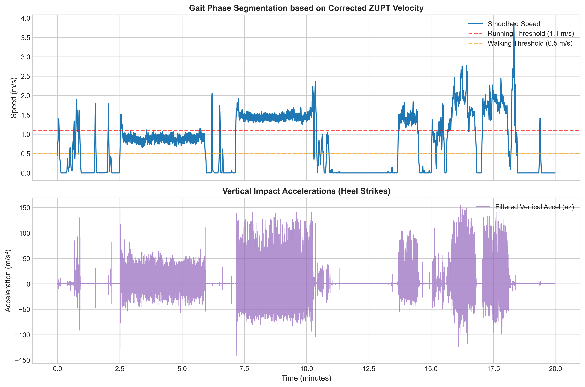

# IMU Running Biomechanics & Fatigue Analysis 🏃🏽‍♀️⚙️

An automated, data-driven Python pipeline designed to process raw IMU accelerometer data from wearable sensors, extract accurate running kinematics, and predict lower-limb structural fatigue. 

This project was developed to bridge the gap between raw wearable sensor data and clinically relevant biomechanical metrics, specifically focusing on the impact of long-distance running (e.g., marathons) on tibial stress fracture risks.

## 🚀 Key Features

* **Advanced Signal Preprocessing:** Implements gravity bias removal and a 4th-order zero-phase Butterworth bandpass filter to isolate athletic foot translations and heel-strike shocks.
* **3D ZUPT Kinematic Integration:** Solves the classic IMU integration drift problem by utilizing a 3D vector-based Forward Euler integration coupled with a **Zero Velocity Update (ZUPT)** algorithm.
* **Automated Gait Segmentation:** Classifies continuous exercise sessions into *Standing*, *Walking*, and *Running* intervals using smoothed velocity thresholds.
* **Biomechanical Kinetic Modeling:** Estimates Ground Reaction Forces (GRF) using joint-damping correction coefficients, validated against standard biomechanics literature (2.2–2.5 Body Weight).
* **Fatigue Failure Prediction:** Applies **Miner's Cumulative Damage Rule** and an empirical S-N fatigue model to quantify tibial stress-fracture risks over marathon distances.

## 📊 Visuals & Results



## 🛠️ Dependencies

To run this pipeline, you will need Python 3.x and the following libraries:
* `numpy` (Numerical integrations and vector operations)
* `pandas` (Data manipulation and time-series handling)
* `scipy` (Signal processing, filtering, and peak detection)
* `openpyxl` (For reading Excel data files)
* `matplotlib` (For generating plots)

## 💻 How to Use

1. Clone this repository to your local machine.
2. Ensure you have the required dependencies installed.
3. Place your raw IMU Excel data in the project directory.
4. Update the `target_excel` path in the `main.py` script.
5. Run the script:
   ```bash
   python main.py
